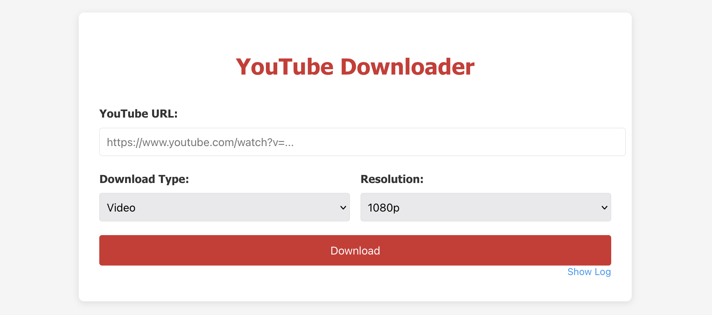

# YouTube Downloader API Service

A lightweight, fast, and reliable API service for downloading videos and audio from YouTube. This service provides a simple way to download YouTube content in various formats and resolutions with a clean web interface.



## Features

- 🖥️ Clean web interface for easy usage
- 🎬 Download YouTube videos in multiple resolutions (360p to 4K)
- 🎵 Extract audio in original format or convert to MP3
- 🌐 REST API with both GET and POST support
- 🔄 Asynchronous download processing
- 📁 Automatic file management with unique naming
- 🔊 High-quality audio extraction
- 🚀 Fast downloads using yt-dlp

## Requirements

- Python 3.8+
- FFmpeg
- Dependencies listed in requirements.txt

## Installation

### Manual Installation

1. Clone the repository:
```bash
git clone https://github.com/yourusername/youtube-downloader-api.git
cd youtube-downloader-api
```

2. Install the required dependencies:
```bash
pip install -r requirements.txt
```

3. Make sure FFmpeg is installed on your system:
```bash
# On Ubuntu/Debian
sudo apt-get install ffmpeg
```

4. Start the service:
```bash
python server.py
```

### Running with Docker Compose

1.  Ensure that Docker and Docker Compose are installed.
2.  Start the service:

    ```bash
    docker compose up -d
    ```

    This command will build the image if it hasn't been built yet, and start the service in detached mode.

## Configuration

The service is configured through the `config.json` file:

```json
{
    "server": {
        "host": "0.0.0.0",
        "port": 5001,
        "workers": 4
    },
    "downloader": {
        "download_dir": "./downloads",
        "base_url": "http://localhost:5001/media",
        "log_file": "logs/youtube_downloader.log",
        "default_resolution": 720,
        "temp_dir": "./temp"
    },
    "api": {
        "cors_origin": "*",
        "access_log": true,
        "rate_limit": {
            "enabled": true,
            "limit": 100,
            "period": 3600
        }
    }
}
```

### Configuration Parameters

| Parameter | Description |
|-----------|-------------|
| `server.host` | Host address to bind the server |
| `server.port` | Port on which the service will run |
| `server.workers` | Number of worker threads for Waitress server |
| `downloader.download_dir` | Directory for storing downloaded files |
| `downloader.base_url` | Base URL for accessing downloaded files |
| `downloader.log_file` | Path to the log file |
| `downloader.default_resolution` | Default resolution for video downloads |
| `downloader.temp_dir` | Directory for temporary files during download |
| `api.cors_origin` | CORS configuration for API access |
| `api.access_log` | Enable/disable access logging |
| `api.rate_limit.enabled` | Enable/disable API rate limiting |
| `api.rate_limit.limit` | Number of requests allowed in the period |
| `api.rate_limit.period` | Time period for rate limiting in seconds |

## API Usage

### Web Interface

Access the web interface by navigating to:
```
http://localhost:5001/
```

### Download Video

```bash
# Using GET
curl "http://localhost:5001/v1/youtube/download?url=https://www.youtube.com/watch?v=EXAMPLE&resolution=720"

# Using POST
curl -X POST http://localhost:5001/v1/youtube/download \
  -H "Content-Type: application/json" \
  -d '{"url":"https://www.youtube.com/watch?v=EXAMPLE", "resolution": 720}'
```

### Download Audio

```bash
# Original format (GET)
curl "http://localhost:5001/v1/youtube/download/audio?url=https://www.youtube.com/watch?v=EXAMPLE"

# MP3 format (POST)
curl -X POST http://localhost:5001/v1/youtube/download/audio/mp3 \
  -H "Content-Type: application/json" \
  -d '{"url":"https://www.youtube.com/watch?v=EXAMPLE"}'
```

### API Response Format

```json
{
  "local_path": "/path/to/downloads/video_title_id_timestamp_uniqueid.mkv",
  "url": "http://localhost:5001/media/video_title_id_timestamp_uniqueid.mkv",
  "title": "Video Title",
  "duration": 360
}
```

## Project Structure

The project consists of the following components:

- `server.py`: Entry point that initializes and starts the service
- `config.json`: Service configuration file
- `app/`: Main application module
  - `__init__.py`: Contains the `YouTubeDownloaderAPI` class for service initialization
  - `downloader.py`: Contains the `YouTubeDownloader` class for downloading videos and audio
  - `video_service.py`: Service layer handling API requests and business logic
  - `routes.py`: Contains the API route definitions
  - `utils.py`: Utility functions, including logging setup
- `static/`: Static files for the web interface
  - `index.html`: Web client for the service

## Advanced Usage

### Modifying the Web Interface

The web interface is contained in a single HTML file at `static/index.html`. You can customize the interface by modifying this file. The interface uses vanilla JavaScript and doesn't require any build process.

### Custom Media Server

If you want to serve downloaded files from a different server or CDN:

1. Update the `downloader.base_url` in `config.json` to point to your media server
2. Configure your media server to serve files from the `download_dir` directory

### File Cleanup

The service doesn't automatically clean up old files. To implement cleanup, you can:

1. Create a cron job that removes files older than `max_age_days` from the `download_dir`
2. Add a cleanup route to the API that triggers file cleanup manually

Example cleanup script:
```python
import os
import time
from pathlib import Path

def cleanup_old_files(directory, max_age_days):
    now = time.time()
    max_age_seconds = max_age_days * 86400
    
    for file_path in Path(directory).glob('*'):
        if os.path.isfile(file_path):
            file_age = now - os.path.getmtime(file_path)
            if file_age > max_age_seconds:
                os.remove(file_path)
                print(f"Removed old file: {file_path}")
```

## Troubleshooting

### Download Issues

If you encounter download errors:
- Ensure that FFmpeg is installed and accessible in the system PATH
- Check that the YouTube URL is valid and the video is available
- Verify that you have sufficient disk space in the download directory
- Check the logs at the configured log file location

### API Access Issues

If you can't access the API:
- Verify that the service is running and listening on the configured port
- Check your network/firewall settings to ensure the port is accessible
- If using Docker, ensure port forwarding is configured correctly
- Check CORS settings if accessing from a web application

## License

This project is licensed under the MIT License - see the LICENSE file for details.

## Acknowledgements

- [yt-dlp](https://github.com/yt-dlp/yt-dlp) for providing the core download functionality
- [Flask](https://flask.palletsprojects.com/) for the web framework
- [Waitress](https://docs.pylonsproject.org/projects/waitress/) for the WSGI server
- [FFmpeg](https://ffmpeg.org/) for audio/video processing